<p align="center">
  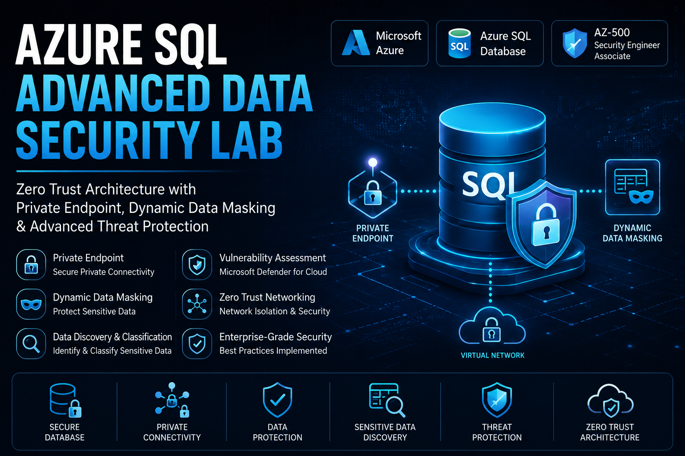
</p>

<h1 align="center">
🔐 Azure SQL Advanced Data Security Lab
</h1>

<h3 align="center">
Zero Trust Azure SQL Architecture with Private Endpoint, Dynamic Data Masking & Vulnerability Assessment
</h3>

<p align="center">


</p>

---

# 📌 Project Overview

This project demonstrates an **enterprise-grade Azure SQL security architecture** focused on:

- 🔐 Data protection
- 🌐 Private connectivity
- 🛡️ Zero Trust database security
- 🎭 Dynamic Data Masking (DDM)
- 🧠 Sensitive data classification
- 🚨 Vulnerability Assessment
- 🔒 Network isolation using Azure Private Endpoint

The lab was designed to simulate how organizations secure highly sensitive customer information inside Azure environments.

---

# 🏗️ Architecture Diagram

<p align="center">
  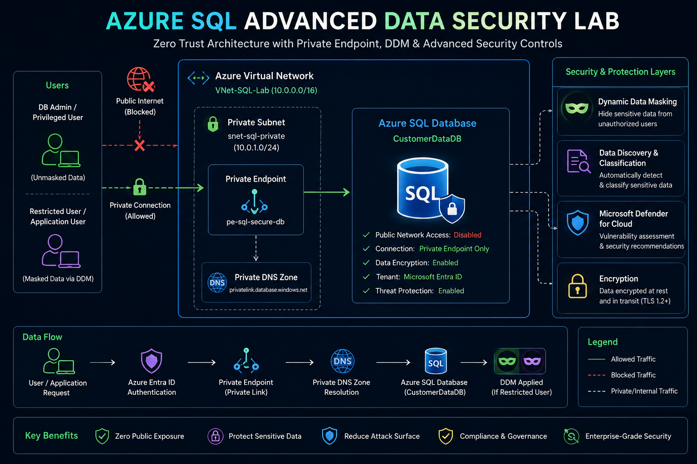
</p>

---

# ⚡ Technologies Used

| Technology | Purpose |
|---|---|
| Azure SQL Database | Managed cloud database |
| Azure Private Endpoint | Private secure connectivity |
| Azure Private DNS Zone | Internal DNS resolution |
| Azure Virtual Network | Network isolation |
| Dynamic Data Masking | Data obfuscation |
| Data Discovery & Classification | Sensitive data detection |
| Microsoft Defender for Cloud | Vulnerability assessment |
| Azure Query Editor | SQL testing |

---

# 🔐 Security Features Implemented

| Security Control | Status |
|---|---|
| Private Endpoint | ✅ |
| Public Network Access Disabled | ✅ |
| Dynamic Data Masking | ✅ |
| Data Discovery & Classification | ✅ |
| Vulnerability Assessment | ✅ |
| Zero Trust Architecture | ✅ |
| Private DNS Integration | ✅ |
| Secure Subnet Isolation | ✅ |

---

# 🌐 Step 1 - Virtual Network Creation

Created a dedicated Virtual Network and private subnet for secure SQL communication.

<p align="center">
  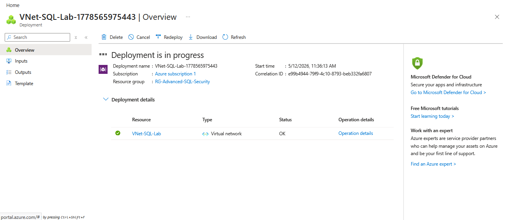
</p>

<p align="center">
  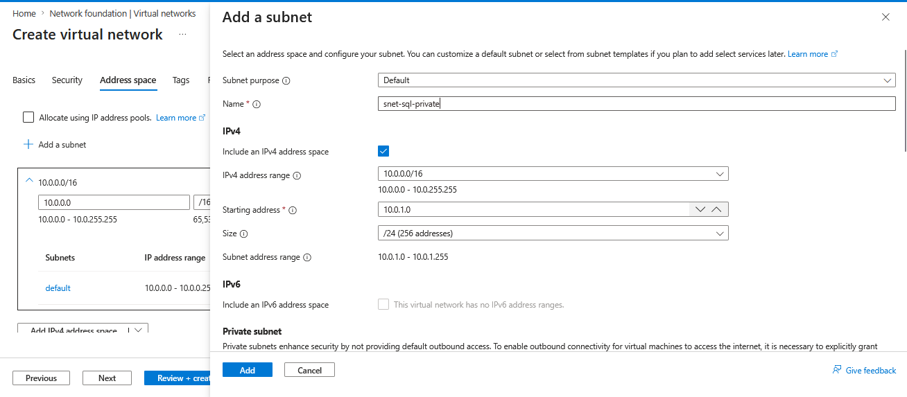
</p>

---

# 🗄️ Step 2 - Azure SQL Database Deployment

Provisioned Azure SQL Database using sample AdventureWorksLT dataset.

<p align="center">
  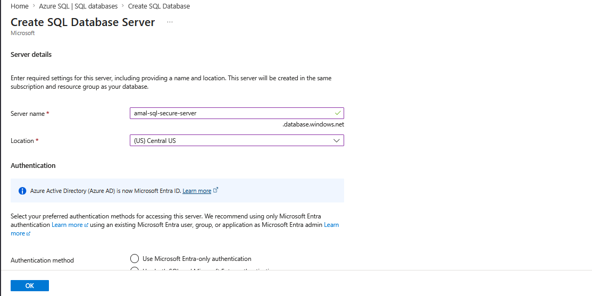
</p>

<p align="center">
  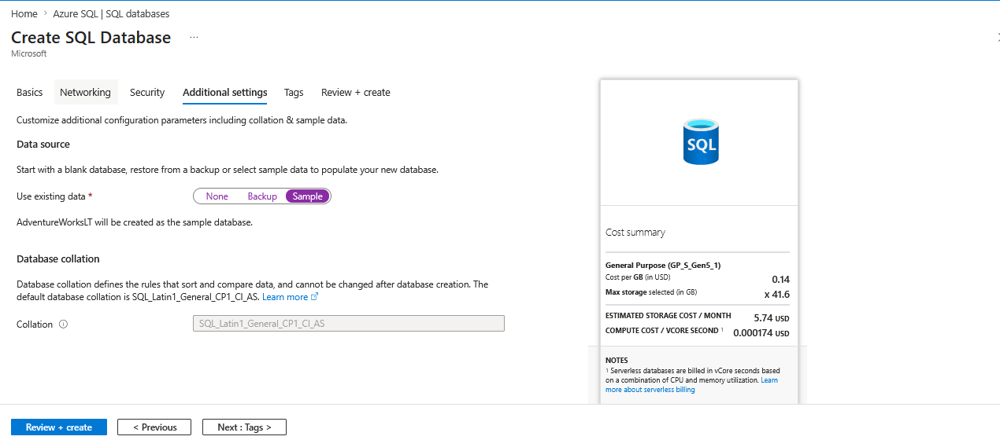
</p>

<p align="center">
  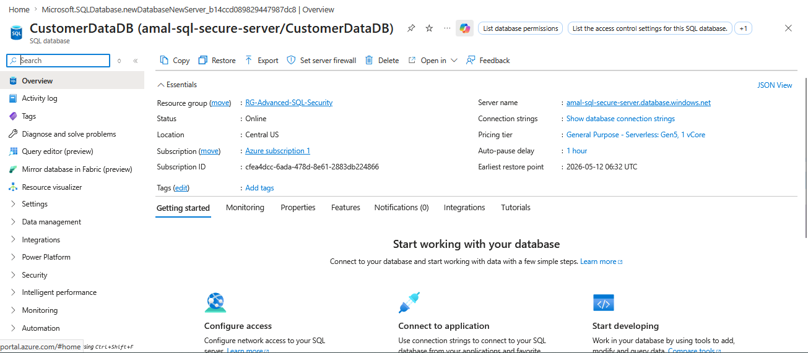
</p>

---

# 🔒 Step 3 - Private Endpoint Configuration

Configured Azure Private Endpoint to ensure database traffic remains inside the private network.

<p align="center">
  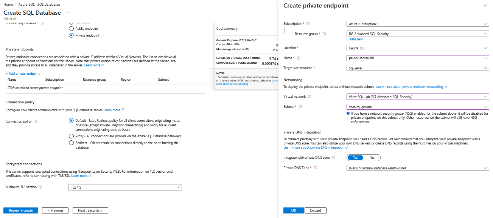
</p>

---

# 🧠 Step 4 - Data Discovery & Classification

Azure SQL automatically detected sensitive customer information such as:

- Email addresses
- Contact information
- Credentials
- Address data

<p align="center">
  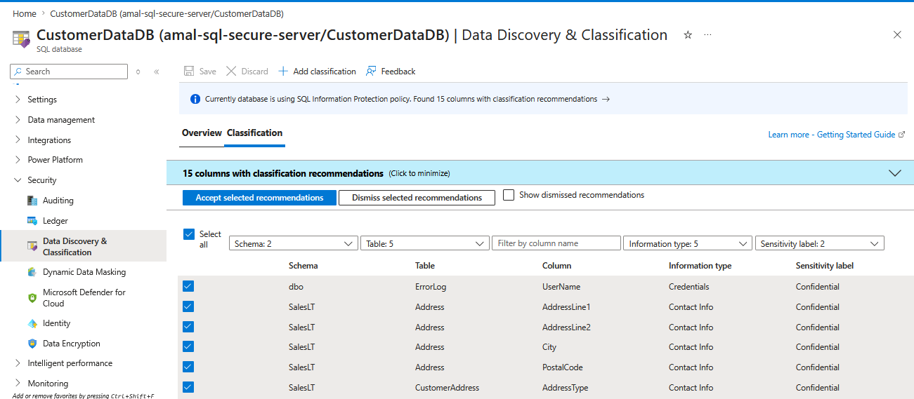
</p>

<p align="center">
  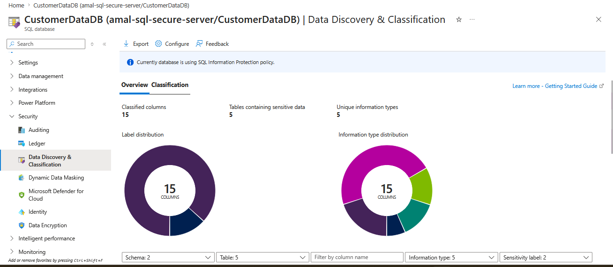
</p>

---

# 🎭 Step 5 - Dynamic Data Masking (DDM)

Configured masking rules for customer email addresses.

Masking format used:

```txt
aXXX@XXXX.com
```

<p align="center">
  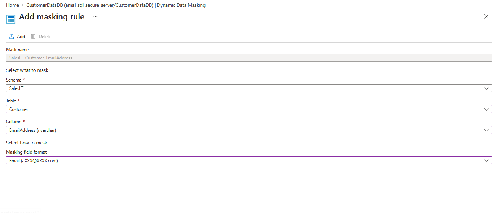
</p>

---

# 👤 Step 6 - Restricted User Testing

Created a low-privileged SQL user to validate masking behavior.

```sql
CREATE USER MaskTestUser WITH PASSWORD = 'Password123!';

GRANT SELECT ON SalesLT.Customer TO MaskTestUser;
```

<p align="center">
  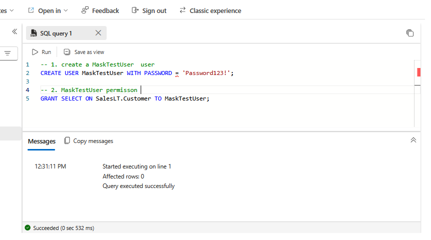
</p>

---

# 🧪 Step 7 - SQL Query Testing

## 🔓 Admin View (Unmasked)

Database administrators can view original sensitive data.

<p align="center">
  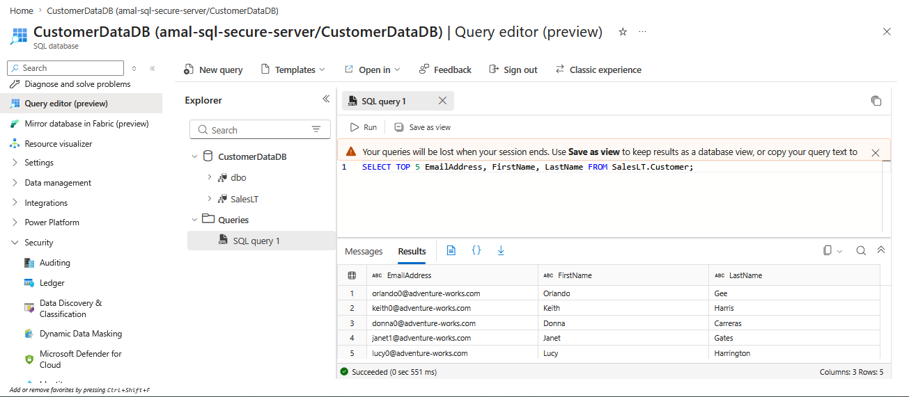
</p>

---

## 🔒 Restricted User View (Masked)

Restricted users only see masked customer information.

<p align="center">
  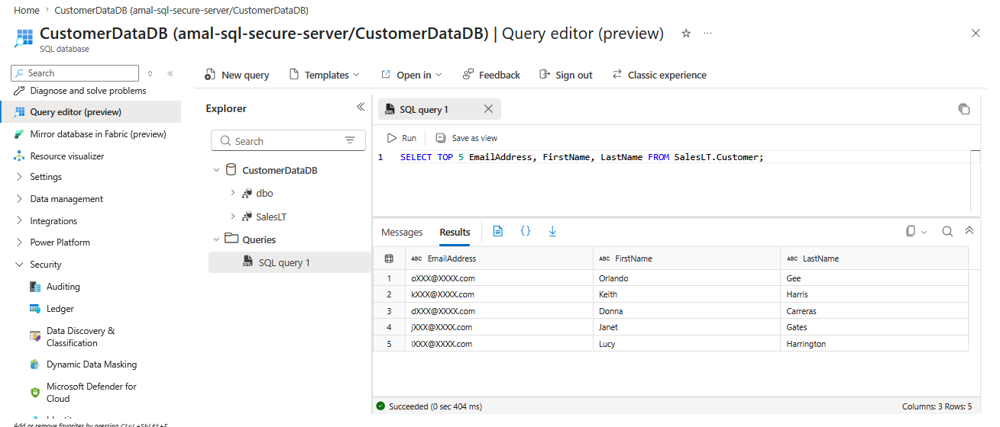
</p>

---

# 🚨 Step 8 - Vulnerability Assessment

Executed Microsoft Defender for Cloud Vulnerability Assessment scans.

The assessment identified database security recommendations and compliance findings.

<p align="center">
  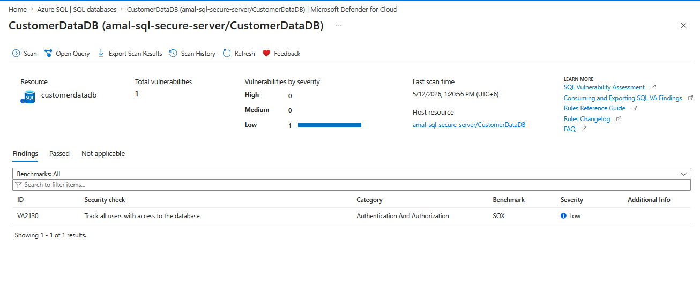
</p>

---

# 🧠 Key Security Concepts Demonstrated

| Concept | Coverage |
|---|---|
| Azure SQL Security | ✅ |
| Dynamic Data Masking | ✅ |
| Zero Trust Security | ✅ |
| Network Isolation | ✅ |
| Azure Private Link | ✅ |
| Vulnerability Assessment | ✅ |
| Sensitive Data Classification | ✅ |
| Private DNS Resolution | ✅ |

---

# 🎯 AZ-500 Skills Covered

This project directly supports the following AZ-500 exam domains:

- Secure Azure SQL databases
- Configure Private Endpoints
- Implement Zero Trust networking
- Configure data protection controls
- Secure PaaS resources
- Implement vulnerability management
- Protect sensitive customer information

---

# 🏆 Final Outcome

This lab successfully demonstrated how organizations can:

✅ Secure Azure SQL databases using private networking  
✅ Protect sensitive customer information using DDM  
✅ Detect classified sensitive data automatically  
✅ Reduce public attack surface exposure  
✅ Implement Zero Trust cloud database architecture  

---

# 👨‍💻 Author

## Amal Udayanga Basnayake

🔗 Portfolio  
https://amalcyberlab.vercel.app

🔗 GitHub  
https://github.com/AmalUBasnayake

🔗 LinkedIn  
https://linkedin.com/in/amal-udayanga-basnayake

---

# ⭐ If you found this project useful

Consider giving the repository a ⭐ to support my cybersecurity learning journey.
